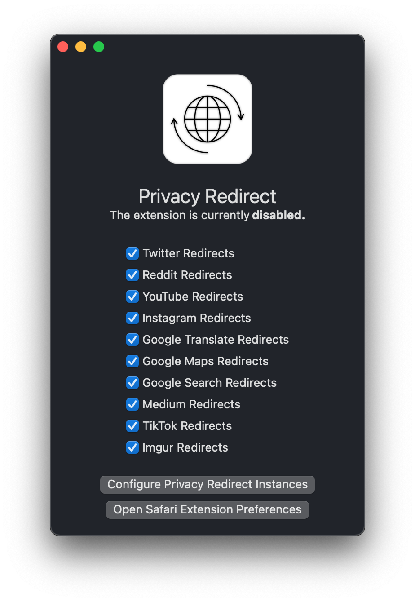

# Privacy Redirect for Safari

A configurable web extension that redirects Twitter, YouTube, Reddit,
Google Maps, Google Search, & Google Translate to privacy friendly
alternatives.

A fork of Simon Brazell's [Privacy Redirect][fork] written with SwiftUI
and JavaScript for macOS.

## Screenshots

## Todo
- [X] Get redirects working
  - [X] Big Sur
  - [X] Monterey
- [ ] Make extension Apple-y
  - [X] Move settings to SwiftUI app
  - [X] Make settings actually work
  - [ ] Port to iOS

## License

[GPLv3](COPYING).

[fork]: https://github.com/SimonBrazell/privacy-redirect
